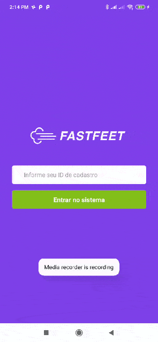
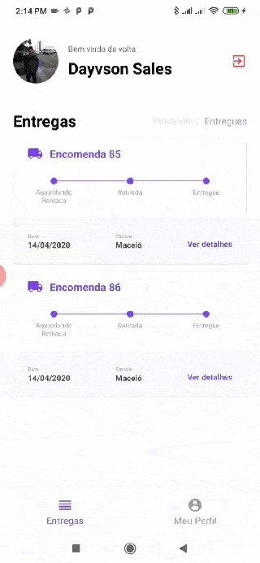
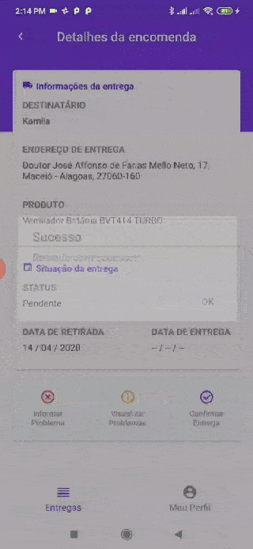

<h1 align="center">
  
</h1>

<h3 align="center">
  FastFeet
</h3>

<h3 align="center">
  :rocket: Desafio Final :rocket:
</h3>

<p>Esse repositório é do FastFeet, que é uma aplicação completa (Back-end, Front-end e Mobile) que é avaliada para emissão do Certificado do Bootcamp GoStack!</p>

<p align="center">
  <a href="#sobre">Sobre o desafio</a>&nbsp;&nbsp;&nbsp;|&nbsp;&nbsp;&nbsp;<a href="#instruções">Instruções</a>&nbsp;&nbsp;&nbsp;|&nbsp;&nbsp;&nbsp;<a href="#mobile">Mobile</a>&nbsp;&nbsp;&nbsp;|&nbsp;&nbsp;&nbsp;<a href="#web">Web</a>&nbsp;&nbsp;&nbsp;|&nbsp;&nbsp;&nbsp;<a href="#insomnia">Insomnia</a>
</p>

## Sobre

FastFeet é uma aplicação para controle de deliveries. 

A versão web do projeto FastFeet representa a visão da distribuidora, ou seja, todas funcionalidades presentes na versão web são para administradores. As funcionalidades para o entregador serão dispostas no aplicativo mobile.

A versão mobile do projeto FastFeet representa a visão do entregador, ou seja, todas funcionalidades presentes nesse projeto são para entregadores.

## Instruções

Para funcionar o projeto inteiro primeiramente você deve ter configurado o PostgreSQL com um banco de dados chamado <strong>fastfeet</strong> e o Redis configurado. Depois entre no projeto <strong>backend</strong> e, de acordo com o arquivo .env.example, crie um .env com as variáveis preenchidas. Para debug é utilizado a ferramenta Reactotron.

Dentro do projeto <strong>backend</strong> execute ``yarn``, para instalar as dependências, depois execute os comando ``yarn sequelize db:migrate`` e ``yarn sequelize db:seed:all``, que irão criar as tabelas e o usuário inicial (login: admin@fastfeet.com senha: 123456) e, por fim, rode ``yarn dev`` e ``yarn queue`` para rodar a aplicação e a fila de e-mail, respectivamente.  

Para o projeto <strong>frontend</strong>, execute ``yarn`` e ``yarn start``.  

Para o projeto <strong>mobile</strong>, execute ``yarn`` e rode o projeto de acordo com sua plataforma (veja mais na documentação do React Native). Para rodar em um aparelho você deverá alterar os arquivos config/Reactotron.js e services/api.js para adicionar o IP que o backend está rodando. Por exemplo, se você está em rede 10.0.0.100 e seu smartphone em 10.0.0.101, altere o IP localizado em api.js para 10.0.0.100:3333 e adicione dentro de configure() um objeto `{ host: '10.0.0.100'}`.

## Mobile

O projeto foi testado em um aparelho Redmi Note 8T e no simulador iPhone X, versão 12.0, xcode 10.

  

## Web

Dentro da pasta frontend há screenshots do projeto web.   

## Insomnia

Se você deseja apenas testar a API, há um arquivo chamado ```Fastfeet-insomnia.json``` na raiz que poderá ser importado dentro da ferramenta Insomnia e que possui as rotas do backend.
